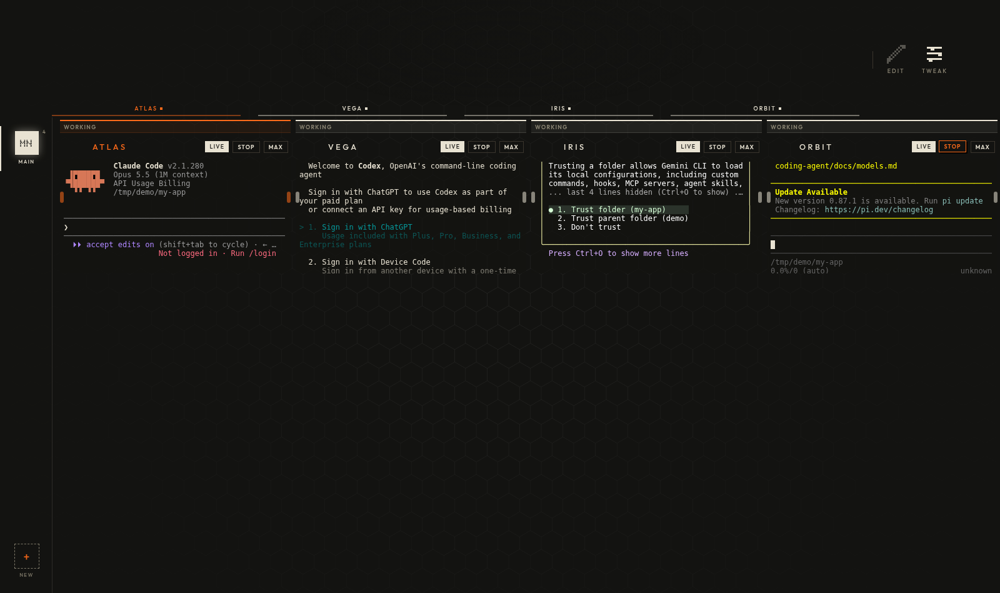
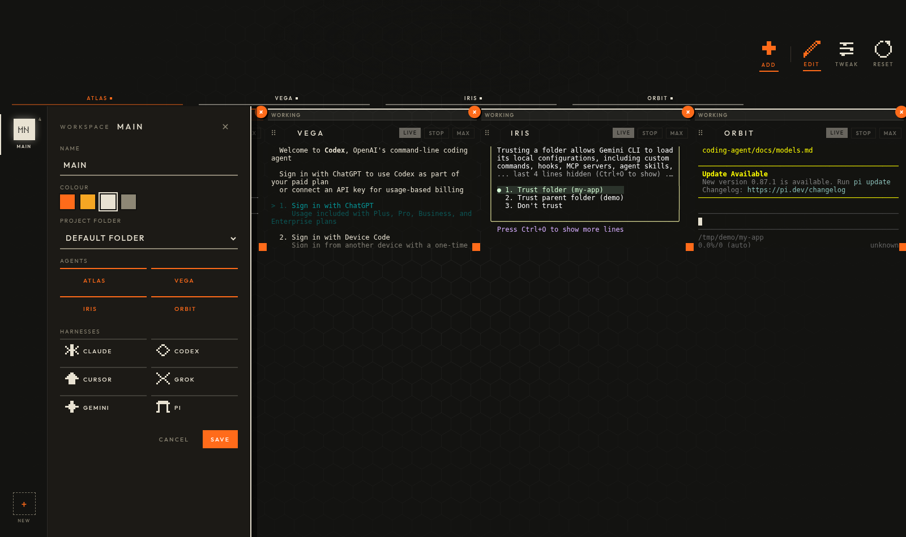

# Agent Terminal

A browser page with a grid of real terminals, one per coding agent.

Run **Claude Code, Codex, Cursor, Grok, Gemini and Pi** side by side, each in its own folder. Draw a line between two tiles and those two agents can share context and hand work to each other. The page shows up as **Agent Console**.

- Runs on your laptop or your own server
- No accounts, no telemetry, and the page makes no external requests



*A fresh install: four named agents, each a real terminal in the same folder. Every CLI is on its own first-run or sign-in screen.*

## Quick start

```bash
git clone <this repo> agentterminal
cd agentterminal
npm install
npm run setup     # a few questions; safe to re-run
npm run check     # proves it works
npm start
```

Open **http://localhost:5075**.

**Having a coding agent install this?** Tell it: *"Read INSTALL-FOR-AGENTS.md and install Agent Terminal."*

## Requirements

- Node 20+
- Linux also needs a compiler for `node-pty`: `sudo apt-get install -y build-essential python3`
- At least one coding CLI:

| CLI | Install |
|---|---|
| Claude Code | `npm install -g @anthropic-ai/claude-code` |
| OpenAI Codex | `npm install -g @openai/codex` |
| Cursor Agent | `curl https://cursor.com/install -fsS \| bash` |
| Grok | `curl -fsSL https://x.ai/cli/install.sh \| bash` |
| Gemini CLI | `npm install -g @google/gemini-cli` |
| Pi | `npm install -g @earendil-works/pi-coding-agent` |

## Using it

| To | Do |
|---|---|
| Add a terminal | **EDIT → ADD**, switch on a CLI, pick a folder, **SAVE**, then **START** |
| Keep a named agent | Add it during `npm run setup`. It gets a permanent tile. |
| Connect two terminals | Drag from one tile's **port** (left or right edge) to another's |
| Separate projects | Use **+** in the dock to make a new workspace |
| Full screen | **MAX** on the tile |



## Running it on a server

Answer **yes** to *"open this from another machine"* in setup.

> **This page gives whoever opens it a real shell.** Keep it behind a VPN, Tailscale or an SSH tunnel. Never expose it to the internet.

## Files

```
server.js            the terminal server
index.html           the whole UI, no build step
setup.mjs            npm run setup — writes config.json
check.mjs            npm run check — end-to-end install test
config.default.json  every setting, documented (don't edit; setup writes config.json)
tools/               agent linking and project-bar helpers
vendor/              xterm.js
docs/                screenshots
test/smoke.mjs       npm test
```

Your settings live in `config.json`, and secrets live in `.env`. Both files are gitignored. Runtime state is kept in `~/.agent-console/`.

MIT licensed. Bundles xterm.js (MIT).
